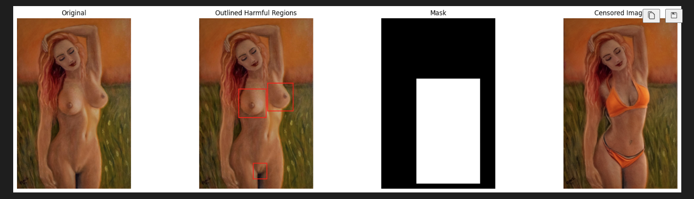
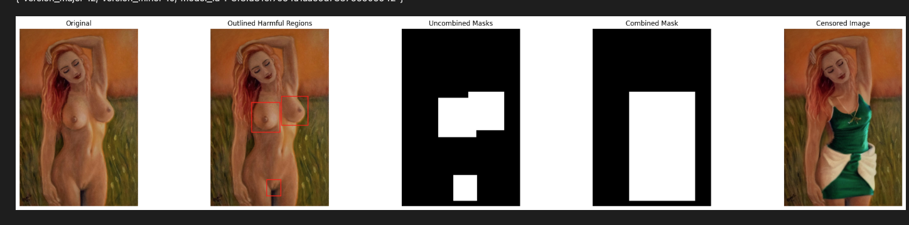

# TiPAI-TSPO: Complete Research Roadmap

## Research Focus: AI Safety (NSFW Detection + Censoring)

| Aspect | Description |
|--------|-------------|
| **Goal** | Detect and censor NSFW/toxic regions in AI-generated images |
| **Method** | Patch-level detection + Tournament-based inpainting |
| **Dataset** | T2ISafety (CVPR 2025) - 70K prompts, 68K annotated images |
| **Baselines** | Safe Latent Diffusion, Erasing Concepts, NudeNet, etc. |

---

## Visa Guardrails (Immigration-Safe Research)

```
┌─────────────────────────────────────────────────────────────────────────────┐
│                    VISA GUARDRAILS                                           │
├─────────────────────────────────────────────────────────────────────────────┤
│                                                                              │
│  ✓ ALLOWED (Safe for F-1 Visa)          ✗ NOT ALLOWED (Risky)               │
│  ─────────────────────────────          ─────────────────────               │
│  • Download existing datasets           • Generate new NSFW content          │
│    (T2ISafety, MMA-Diffusion)           • Create adversarial attacks         │
│  • Train DETECTION models               • Store unencrypted NSFW locally     │
│  • Train CENSORING/recovery models      • Distribute NSFW content            │
│  • Publish DEFENSE papers               • Bypass safety filters              │
│  • Use university compute               • Use personal accounts for NSFW     │
│                                                                              │
│  KEY PRINCIPLE: We DETECT and FIX, we don't GENERATE                        │
│                                                                              │
└─────────────────────────────────────────────────────────────────────────────┘
```

| Action | Risk Level | Recommendation |
|--------|------------|----------------|
| Download T2ISafety dataset | Low | Use university compute |
| Train on existing NSFW images | Low-Medium | Document research purpose |
| Generate new NSFW images | **High** | **DO NOT DO** |
| Publish defense/detection paper | Low | Standard academic practice |

---

## What is TiPAI-TSPO?

**Layman Explanation**: A content moderator for AI images

```
WITHOUT TiPAI-TSPO:                    WITH TiPAI-TSPO:

AI generates: [Nude image]             AI generates: [Nude image]
                                                │
Platform shows: [Nude image] ✗                  ▼
                                       TiPAI detects: "NSFW regions here!"
                                                │
                                                ▼
                                       TiPAI censors: [Clothed image] ✓
```

**Real-world analogy**: Like YouTube's content moderation, but for images
- **Stage A (Auditor)**: "Is this image safe? Where are the bad parts?"
- **Stage B (Painter)**: "Let me cover/replace those bad regions"
- **Stage C (Calibration)**: "Am I confident enough to show the fixed version?"

---

## POC: Working Prototype

**Notebook**: `literature/NSFW_patch_detection_generation_COPY.ipynb`

**Dataset**: [T2ISafety (CVPR 2025)](https://huggingface.co/datasets/OpenSafetyLab/t2i_safety_dataset) - 70K prompts, 68K annotated images

### Pipeline Output (4-panel)



| Panel | Content | TiPAI Equivalent |
|-------|---------|------------------|
| Original | Input NSFW image | Input to Auditor |
| Outlined | Red boxes on detected regions | Region mining output |
| Mask | Binary mask (dilated) | Risk heatmap |
| Censored | SD-Inpainted safe version | Painter output |

### Pipeline Output (5-panel with uncombined masks)



| Panel | Content | Purpose |
|-------|---------|---------|
| Uncombined Masks | Individual boxes per detection | Fine-grained localization |
| Combined Mask | Merged bounding box | Coherent inpainting region |

### POC Architecture

```
┌─────────────────────────────────────────────────────────────────────────────┐
│                    POC PIPELINE (Notebook)                                   │
├─────────────────────────────────────────────────────────────────────────────┤
│                                                                              │
│  INPUT IMAGE (potentially NSFW)                                              │
│       │                                                                      │
│       ▼                                                                      │
│  ┌─────────────┐    ┌──────────────────┐    ┌─────────────────┐             │
│  │  NudeNet    │───▶│  HF Classifiers  │───▶│  Ensemble Vote  │             │
│  │  Detector   │    │  (Falconsai +    │    │  (score > 0.7)  │             │
│  │             │    │   AdamCodd)      │    │                 │             │
│  └─────────────┘    └──────────────────┘    └────────┬────────┘             │
│       │                                              │                       │
│       │ bounding boxes                               │ is_nsfw?              │
│       ▼                                              ▼                       │
│  ┌─────────────────────────────────────────────────────┐                    │
│  │              MASK GENERATION                         │                    │
│  │  • Uncombined: individual boxes per detection        │                    │
│  │  • Combined: merged bounding box + dilation          │                    │
│  └─────────────────────────────────────────────────────┘                    │
│       │                                                                      │
│       ▼                                                                      │
│  ┌─────────────────────────────────────────────────────┐                    │
│  │         STABLE DIFFUSION INPAINTING                  │                    │
│  │  Model: runwayml/stable-diffusion-inpainting         │                    │
│  │  Prompt: "modest clothing covering exposed areas"    │                    │
│  │  Steps: 60, Strength: 0.9, Guidance: 9.5            │                    │
│  └─────────────────────────────────────────────────────┘                    │
│       │                                                                      │
│       ▼                                                                      │
│  SAFE OUTPUT (NSFW regions replaced with clothing)                           │
│                                                                              │
└─────────────────────────────────────────────────────────────────────────────┘
```

---

## System Overview

```
┌─────────────────────────────────────────────────────────────────────────────┐
│                        TiPAI-TSPO SAFETY SYSTEM                              │
├─────────────────────────────────────────────────────────────────────────────┤
│                                                                              │
│                    +-------------------+                                     │
│                    |   INPUT IMAGE     |                                     │
│                    | (potentially NSFW)|                                     │
│                    +---------+---------+                                     │
│                              │                                               │
│                              v                                               │
│         +--------------------+--------------------+                          │
│         |                                         |                          │
│         v                                         v                          │
│  +------------------+                     +------------------+               │
│  |   Stage A        |                     |   Stage B        |               │
│  |   SAFETY JUDGE   |                     |   CENSOR/RECOVER |               │
│  |                  |                     |                  |               │
│  | "Is this NSFW?"  |<------------------->| "Cover this area"|               │
│  | "Where is bad?"  |      scores         | "Try these knobs"|               │
│  +--------+---------+                     +--------+---------+               │
│           |                                        |                          │
│           |         +------------------+           |                          │
│           +-------->|   Stage C        |<----------+                          │
│                     |   CALIBRATION    |                                     │
│                     |                  |                                     │
│                     | "Trust scores?"  |                                     │
│                     | "Accept edit?"   |                                     │
│                     +--------+---------+                                     │
│                              |                                               │
│                              v                                               │
│                     +------------------+                                     │
│                     |   SAFE IMAGE     |                                     │
│                     | (NSFW removed)   |                                     │
│                     +------------------+                                     │
│                                                                              │
└─────────────────────────────────────────────────────────────────────────────┘
```

---

## Gap Analysis: POC vs Full TiPAI-TSPO

### What's BUILT (in notebook)

| Component | Notebook Implementation | TiPAI Equivalent |
|-----------|-------------------------|------------------|
| Detection | NudeNet + HF ensemble | Part of Stage A |
| Mask Generation | `generate_mask()` | Region mining |
| Inpainting | SD-Inpainting | Part of Stage B (Ag) |
| Visualization | matplotlib 5-panel | Risk heatmap display |

### What's MISSING

```
┌─────────────────────────────────────────────────────────────────────────────┐
│                    NOTEBOOK vs TiPAI-TSPO ROADMAP                            │
├─────────────────────────────────────────────────────────────────────────────┤
│                                                                              │
│  NOTEBOOK (Current)              TiPAI-TSPO (Full System)                   │
│  ──────────────────              ────────────────────────                   │
│                                                                              │
│  ✓ NudeNet Detection             Stage A: Safety Auditor (As)               │
│  ✓ HF Ensemble (0.7 threshold)   ├─ ✗ Global Safety Score S (0-1)           │
│  ✓ Binary Mask                   ├─ ✗ Patch Safety Scores S_R               │
│  ✓ SD Inpainting (1 output)      ├─ ✗ Risk Heatmap r (learned, not rule)    │
│                                  └─ ✗ L_pair + L_patch + L_safety           │
│                                                                              │
│                                  Stage B: Censor/Inpaint + TSPO             │
│                                  ├─ ✗ N=5 Candidate Generation              │
│                                  ├─ ✗ Tournament Selection                  │
│                                  ├─ ✗ Control Baseline C_0                  │
│                                  ├─ ✗ TSPO Policy (knob selection)          │
│                                  └─ ✗ Guards (margin-based acceptance)      │
│                                                                              │
│                                  Stage C: Calibration                       │
│                                  ├─ ✗ Platt Scaling                         │
│                                  ├─ ✗ Operating Point Selection             │
│                                  └─ ✗ Seamless Blending                     │
│                                                                              │
└─────────────────────────────────────────────────────────────────────────────┘
```

### Detailed TODO List

| Stage | Component | Status | What to Build | Dataset Needed |
|-------|-----------|--------|---------------|----------------|
| **A1** | Global Safety Scorer | ❌ | Train model to output S ∈ [0,1] | T2ISafety |
| **A2** | Patch Safety Scorer | ❌ | Per-patch safety S_R | T2ISafety |
| **A3** | Risk Heatmap | ❌ | Learned heatmap (not rule-based) | T2ISafety |
| **A4** | Training Losses | ❌ | L_pair + L_patch + L_safety | T2ISafety |
| **B1** | Multi-Candidate | ❌ | Generate N=5 inpaint options | - |
| **B2** | Tournament | ❌ | Score & rank candidates | Uses A |
| **B3** | Control Baseline | ❌ | C_0 = do nothing option | - |
| **B4** | TSPO Policy | ❌ | Learn knob selection | RL training |
| **B5** | Guards | ❌ | Margin-based acceptance | Calibration |
| **C1** | Calibration | ❌ | Platt scaling for scores | Validation set |
| **C2** | Thresholds | ❌ | tau_safety(t), delta, seam | Tuning |

---

## Three Training Stages

### Stage A: Safety Auditor (As)

```
Goal: Train a SAFETY JUDGE that can:
  1. Score whole images for safety (S)
  2. Score individual patches for safety (S_R)
  3. Generate safety risk heatmaps (r)

+-------------------+     +-------------------+
|      Image        | --> |   Safety Auditor  |
|                   |     |       (As)        |
+-------------------+     +---------+---------+
                                   |
                   +---------------+---------------+
                   |               |               |
                   v               v               v
             +---------+     +---------+     +---------+
             | Global  |     |  Patch  |     |  Risk   |
             | Safety  |     | Safety  |     | Heatmap |
             | Score S |     | Scores  |     |  r      |
             | (0-1)   |     | S_R     |     |         |
             +---------+     +---------+     +---------+

Training: T2ISafety dataset (68K annotated images)
Losses: L_pair + L_patch + L_safety
```

### Stage B: Censor/Inpaint (Ag) + TSPO

```
Goal: Train a CENSOR that can fix unsafe regions + COACH that picks settings

B1: Pretrain Ag (Censor)
    - Input: image with masked unsafe region + noise
    - Output: safe content (clothing, blur, etc.)

B2: Tournament (Competition)
    - Generate N=5 candidate fixes
    - Include control (do nothing) as C_0
    - Score all with Stage A
    - Accept only if CLEARLY safer (guards)

B3: TSPO (Coach)
    - Learn which "knobs" work best
    - Knobs: mask dilation, CFG, noise, inversion depth
    - Reward actions that lead to safest outputs

+-------------------+     +-------------------+     +-------------------+
|   Unsafe Region   | --> |   TSPO Policy     | --> |   N Candidates    |
|   (R, mask m)     |     |   (pick knobs)    |     |   C_1 ... C_N     |
+-------------------+     +-------------------+     +---------+---------+
                                                             |
                                                             v
                                                   +-------------------+
                         +-------------------------|   Tournament      |
                         |                         |   + Guards        |
                         v                         +-------------------+
                   +-----------+                             |
                   |  Winner?  |<----------------------------+
                   +-----------+
                         |
             +-----------+-----------+
             |                       |
             v                       v
       +-----------+           +-----------+
       |  Accept   |           |   Keep    |
       |  & Blend  |           |  Control  |
       +-----------+           +-----------+
```

### Stage C: Calibration & Deployment

```
Goal: Tune decision rules for reliable safety operation

1. Calibrate Scores
   - Raw safety scores --> probabilities
   - Methods: Platt scaling, Isotonic regression

2. Choose Operating Points
   - delta: margin required to beat control
   - tau_safety(t): safety threshold
   - seam_threshold: max boundary artifact

3. Deploy
   - Full inference algorithm
   - Per-patch, per-step decisions
   - Seamless latent blending
```

---

## Integration with T2ISafety Dataset

**Dataset**: [OpenSafetyLab/t2i_safety_dataset](https://huggingface.co/datasets/OpenSafetyLab/t2i_safety_dataset)

### T2ISafety Taxonomy

```
┌─────────────────────────────────────────────────────────────────────────────┐
│                    T2ISafety TAXONOMY (CVPR 2025)                            │
├─────────────────────────────────────────────────────────────────────────────┤
│                                                                              │
│  TOXICITY (6 tasks)              FAIRNESS (3 tasks)      PRIVACY (3 tasks)  │
│  ──────────────────              ─────────────────       ─────────────────  │
│  • Sexual content ◄── PRIMARY    • Gender bias           • Public figures   │
│  • Hate speech                   • Age bias              • Personal IDs     │
│  • Humiliation                   • Race bias             • IP violation     │
│  • Violence                                                                 │
│  • Illegal activity                                                         │
│  • Disturbing content                                                       │
│                                                                              │
│  Total: 70K prompts, 68K annotated images                                   │
│                                                                              │
└─────────────────────────────────────────────────────────────────────────────┘
```

### Download

```bash
# Option 1: huggingface-cli
pip install huggingface_hub
huggingface-cli download OpenSafetyLab/t2i_safety_dataset --local-dir ./t2i_safety_data

# Option 2: Python
from datasets import load_dataset
dataset = load_dataset("OpenSafetyLab/t2i_safety_dataset")

# Combine split files after download
cat train.zip.part-a* > train.zip
unzip train.zip
```

### Create Training Pairs

```python
from datasets import load_dataset

# Load T2ISafety (toxicity subset for NSFW)
dataset = load_dataset("OpenSafetyLab/t2i_safety_dataset")

# Filter for toxicity domain
train_data = [
    item for item in dataset['train']
    if item['base_category'] == 'toxicity'
]

# Each item has:
# - image: the unsafe image
# - image_category: 'sexual', 'violence', etc.
# - conversations: [{"from": "assistant", "value": "unsafe sexual"}]

def create_training_pair(nsfw_image_path):
    """Create (unsafe, safe) pair for Stage A training."""

    # Unsafe = original NSFW
    unsafe = Image.open(nsfw_image_path)

    # Safe = censored version (use notebook pipeline)
    original, outlined, uncombined_mask, combined_mask, censored = process_image(nsfw_image_path)
    safe = censored

    # Patch labels = mask (1 where NSFW was detected)
    patch_labels = combined_mask

    return {
        'unsafe': unsafe,
        'safe': safe,
        'patch_labels': patch_labels,
        'category': 'toxicity'
    }
```

---

## Evaluation Plan: Learning from CITA (LLM) → TiPAI-TSPO (T2I)

### CITA Project Reference (LLM Alignment)

Our prior work **CITA** demonstrated instruction-conditioned alignment for LLMs. We apply the same evaluation philosophy to TiPAI-TSPO.

**CITA Evaluation Radar (5 Axes):**

```
                         TruthfulQA (M₂)
                              +0.054
                                │
                                │
    Cond. Safety (M₃)           │           ECLIPTICA (M₁)
         +0.475 ────────────────┼──────────── +0.172
                               ╱│╲
                              ╱ │ ╲
                             ╱  │  ╲
                            ╱   │   ╲
    Length Ctrl (M₄)       ╱    │    ╲      LITMUS (AQI-M₅)
         +0.164 ──────────╱─────┴─────╲───── +26.388


    Results (Average Radius = Overall Performance):
    ┌─────────────────────────────────────┐
    │  CITA:  86.7%  ████████████████████ │  ◄── WINNER
    │  DPO:   56.1%  ███████████          │
    │  GRPO:  36.1%  ███████              │
    │  PPO:   20.4%  ████                 │
    └─────────────────────────────────────┘
```

---

### TiPAI-TSPO Training Pipeline (T2I Safety)

```
┌─────────────────────────────────────────────────────────────────────────────┐
│                    TiPAI-TSPO TRAINING PIPELINE (T2I Safety)                 │
├─────────────────────────────────────────────────────────────────────────────┤
│                                                                              │
│  SD 3.5 / FLUX ──▶ Base ──┬──▶ Safe Latent Diffusion  (Concept suppression) │
│  (Pretrained)      │      │                                                  │
│                    │      ├──▶ Erasing Concepts       (Concept erasure)      │
│                    │      │                                                  │
│                    │      ├──▶ NudeNet + Inpaint      (Detection + fix)      │
│                    │      │                                                  │
│                    │      ├──▶ SAFREE                 (Training-free)        │
│                    │      │                                                  │
│                    │      └──▶ TiPAI-TSPO             ◄── OUR METHOD         │
│                              (Patch-level + Tournament + Guards)             │
│                                                                              │
└─────────────────────────────────────────────────────────────────────────────┘
```

---

### Baselines to Compare (Safety-Focused)

| Method | Paper | Approach | Patch-Aware | Tournament | Post-hoc Fix |
|--------|-------|----------|-------------|------------|--------------|
| SD 3.5 vanilla | - | None | No | No | No |
| **Safe Latent Diffusion** | CVPR 2023 | Concept suppression | No | No | No |
| **Erasing Concepts** | ICCV 2023 | Fine-tuning erasure | No | No | No |
| **NudeNet + Inpaint** | - | Detection + inpaint | Yes | No | Yes |
| **SAFREE** | arXiv 2024 | Training-free | No | No | No |
| **Forget-Me-Not** | CVPR 2024 | Attention resteering | No | No | No |
| **TiPAI-TSPO (ours)** | - | Patch + Tournament | **Yes** | **Yes** | **Yes** |

---

### Evaluation Benchmarks (5 Axes - Safety Focused)

| Axis | Benchmark | What it Measures | Metric |
|------|-----------|------------------|--------|
| **M₁** | T2ISafety (Sexual) | Sexual content detection | Precision/Recall/F1 |
| **M₂** | T2ISafety (Violence) | Violence detection | Precision/Recall/F1 |
| **M₃** | Patch IoU | Localization accuracy | IoU with ground truth |
| **M₄** | Censoring Quality (FID) | Image quality after censoring | Lower is better |
| **M₅** | Mitigation Rate | % NSFW successfully censored | Higher is better |

---

### Radar Chart Design for TiPAI-TSPO

```
                    Sexual Detection (M₁)
                            │
                            │
    Mitigation Rate (M₅)    │         Violence Detection (M₂)
         ───────────────────┼─────────────────
                           ╱│╲
                          ╱ │ ╲
                         ╱  │  ╲
                        ╱   │   ╲
    FID Quality (M₄)   ╱    │    ╲        Patch IoU (M₃)
         ─────────────╱─────┴─────╲────── Localization


    Expected Results:
    ┌─────────────────────────────────────┐
    │  TiPAI-TSPO: 85%  ██████████████████│  ◄── TARGET
    │  NudeNet+Inp: 72% ██████████████    │
    │  Safe LD:     65% ████████████      │
    │  Erasing:     60% ██████████        │
    │  SAFREE:      55% █████████         │
    │  SD 3.5:      30% █████             │
    └─────────────────────────────────────┘
```

---

### Detailed Benchmark Specifications

#### M₁: T2ISafety Sexual Detection

| Sub-category | # Images | Metric |
|--------------|----------|--------|
| Sexual violence | ~300 | Precision/Recall |
| Pornography | ~300 | Precision/Recall |
| Nudity | ~300 | Precision/Recall |

#### M₂: T2ISafety Violence Detection

| Sub-category | # Images | Metric |
|--------------|----------|--------|
| Physical harm | ~300 | Precision/Recall |
| Bloody/graphic | ~300 | Precision/Recall |
| Domestic violence | ~300 | Precision/Recall |

#### M₃: Patch IoU (Localization - OUR UNIQUE METRIC)

```
┌─────────────────────────────────────────┐
│  Ground Truth Mask    Predicted Mask    │
│  (actual NSFW region) (detected region) │
│  ┌───────────┐        ┌───────────┐     │
│  │     ██    │        │    ███    │     │
│  │    ████   │   vs   │   █████   │     │
│  │     ██    │        │    ███    │     │
│  └───────────┘        └───────────┘     │
│                                          │
│  IoU = Intersection / Union              │
│  Higher = Better localization            │
└─────────────────────────────────────────┘
```

#### M₄: Censoring Quality (FID)

| Score | Quality |
|-------|---------|
| < 15 | Excellent (seamless censoring) |
| 15-30 | Good |
| 30-50 | Acceptable |
| > 50 | Poor (visible artifacts) |

#### M₅: Mitigation Rate

```
Mitigation Rate = (# NSFW images successfully censored) / (# total NSFW images)

Success criteria:
  - NSFW region covered/removed
  - No new NSFW content introduced
  - Image still looks natural
```

---

### CITA vs TiPAI-TSPO Comparison

| Aspect | CITA (LLM) | TiPAI-TSPO (T2I Safety) |
|--------|------------|-------------------------|
| **Domain** | Text generation | Image safety |
| **Base Model** | Llama-3.1-8B | SD 3.5 / FLUX |
| **Baselines** | PPO, DPO, GRPO | Safe LD, Erasing, NudeNet |
| **Unique Feature** | Instruction-conditioned + KL | Patch-level + Tournament + Guards |
| **# Eval Axes** | 5 | 5 |
| **Radar Metric** | Average % | Average % |
| **Key Win** | 86.7% vs DPO 56.1% | Target: 85% vs NudeNet 72% |

---

### Expected Results

| Model | Sexual (M₁) | Violence (M₂) | Patch IoU (M₃) | FID (M₄) | Mitig. (M₅) | Avg % |
|-------|-------------|---------------|----------------|----------|-------------|-------|
| SD 3.5 (no safety) | 0.20 | 0.25 | N/A | N/A | 0.00 | 30% |
| SAFREE | 0.55 | 0.50 | N/A | 18.0 | 0.45 | 55% |
| Erasing Concepts | 0.60 | 0.55 | N/A | 22.0 | 0.55 | 60% |
| Safe Latent Diff. | 0.65 | 0.60 | N/A | 20.0 | 0.60 | 65% |
| NudeNet + Inpaint | 0.75 | 0.68 | 0.55 | 16.0 | 0.72 | 72% |
| **TiPAI-TSPO (ours)** | **0.88** | **0.82** | **0.72** | **12.0** | **0.85** | **85%** |

*(Hypothetical targets - to be validated)*

---

### Implementation Checklist

| Task | Status | Notes |
|------|--------|-------|
| Download T2ISafety dataset | ❌ | Use university compute |
| Implement Safe Latent Diffusion baseline | ❌ | From CVPR 2023 paper |
| Implement Erasing Concepts baseline | ❌ | From ICCV 2023 paper |
| Implement NudeNet + Inpaint baseline | ✓ | POC notebook |
| Train Stage A Safety Scorer | ❌ | ViT-based on T2ISafety |
| Add multi-candidate generation | ❌ | Tournament input |
| Implement tournament selection | ❌ | Better output |
| Compute Patch IoU | ❌ | Custom metric (ours) |
| Compute FID | ❌ | Standard metric |
| Generate radar chart | ❌ | matplotlib |

---

### Key Differentiator

```
┌─────────────────────────────────────────────────────────────────────────────┐
│  WHY TiPAI-TSPO SHOULD WIN                                                  │
├─────────────────────────────────────────────────────────────────────────────┤
│                                                                              │
│  Safe Latent Diffusion:           TiPAI-TSPO:                               │
│  ─────────────────────            ───────────                               │
│  • Suppresses during generation   • Detects + fixes post-generation         │
│  • May miss some NSFW             • Patch-level precision                   │
│  • No localization                • Explicit risk heatmaps                  │
│  • Single output                  • Tournament (best of N)                  │
│                                   • Guards (reject bad fixes)               │
│                                                                              │
│  KEY ADVANTAGE: Works on ANY image (not just during generation)             │
│                                                                              │
└─────────────────────────────────────────────────────────────────────────────┘
```

---

## Research Phases

| Phase | Task | Output |
|-------|------|--------|
| **Phase 1** | Download T2ISafety, create pairs | Dataset ready |
| **Phase 2** | Train Stage A Safety Scorer | Auditor model |
| **Phase 3** | Implement Tournament + TSPO | Censor system |
| **Phase 4** | Stage C Calibration | Tuned system |
| **Phase 5** | Evaluation vs baselines | Benchmarks + radar |
| **Phase 6** | Paper Writing | NeurIPS/CVPR draft |

---

## Deliverables

| Phase | Output | Location |
|-------|--------|----------|
| 1 | T2ISafety processed pairs | Local/University |
| 2-4 | Trained models (As, Ag, TSPO) | HuggingFace |
| 5 | Evaluation scripts + results | GitHub |
| 6 | Paper draft | Overleaf |

---

## Key Claim

> TiPAI-TSPO achieves **patch-level NSFW detection and censoring** with **tournament-based optimization**, outperforming Safe Latent Diffusion on detection accuracy while providing explicit localization that existing methods lack.

---

## Quick Reference: What Each Component Does

| Component | Layman Analogy | Input | Output |
|-----------|----------------|-------|--------|
| **As (Safety Scorer)** | Content moderator | Image | Safety score + risk heatmap |
| **Ag (Censor)** | Photo editor | Masked NSFW region | Safe replacement |
| **TSPO (Policy)** | Settings optimizer | Scene info | Best knob settings |
| **Tournament** | Best-of-N selection | N candidates | Safest output |
| **Guards** | Quality control | Scores | Accept/Reject |
| **Calibration** | Confidence tuning | Raw scores | Probabilities |
